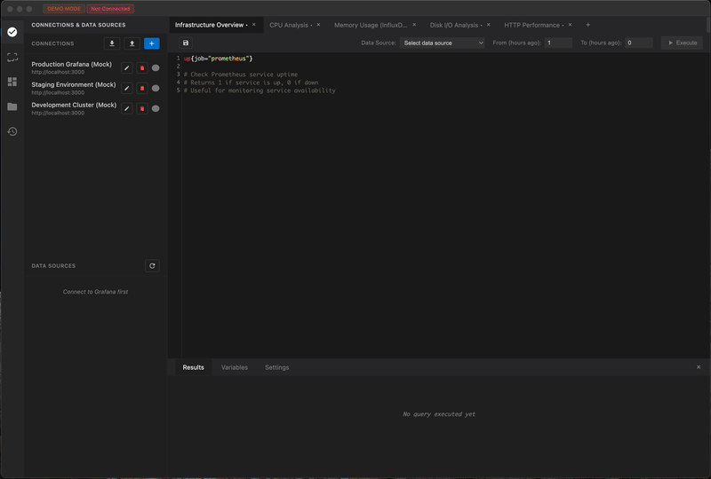

# Grafana Query IDE

A powerful cross-platform desktop application for executing InfluxQL and PromQL queries through the Grafana API. Built with Electron, featuring an advanced VS Code-like interface with syntax highlighting, intelligent auto-completion, file system integration, and native desktop experience.



## ✨ Key Features

### 🖥️ **Native Desktop Experience**
- **Cross-platform**: Windows, macOS, and Linux support
- **Native file system**: Save and load query files (.promql, .isql, .sql)
- **Menu shortcuts**: Keyboard shortcuts for all major operations (Ctrl+S, Ctrl+Enter, etc.)
- **VS Code-like interface**: Familiar tabbed editor with sidebar panels
- **Native dialogs**: OS-native file open/save dialogs

### 🔐 **Advanced Connection Management**
- **Multiple connections**: Save and manage multiple Grafana server connections
- **Secure storage**: Connection details saved locally (passwords never stored)
- **Quick switching**: Select between saved connections
- **Connection preferences**: Remember default data source per connection
- **Proxy support**: Built-in SOCKS5 proxy support for secure connections

### 📝 **Professional Code Editor**
- **Syntax highlighting**: Custom PromQL and InfluxQL syntax highlighting
- **Intelligent autocomplete**: 
  - **PromQL**: 40+ functions including `rate()`, `histogram_quantile()`, `topk()`
  - **InfluxQL**: 30+ SQL keywords and InfluxDB-specific functions
- **Real-time validation**: Immediate syntax error detection and feedback
- **Auto-detection**: Query language automatically selected based on data source
- **Multi-tab support**: Work with multiple queries simultaneously
- **Resizable editor**: Adjustable height for complex queries

### 🔍 **Schema Explorer**
- **Interactive discovery**: Browse database schema with click-to-insert
- **Prometheus**: Explore metrics and labels with search functionality
- **InfluxDB**: Browse retention policies, measurements, fields, and tags
- **Smart caching**: Avoid expensive reloads with intelligent caching
- **Field-tag filtering**: See only tags associated with selected fields

### 📊 **Query Variables System**
- **Dynamic queries**: Define reusable variables with query results
- **Multi-value support**: Select multiple values for regex patterns
- **Regex filtering**: Transform variable values with regex patterns
- **Connection-scoped**: Variables automatically filtered by current connection
- **Substitution**: Use `$variable` or `${variable}` syntax in queries

### 🗂️ **Dashboard Explorer**
- **Search dashboards**: Find dashboards across your Grafana instance
- **Query extraction**: Automatically extract all queries from dashboard panels
- **Copy to editor**: One-click copying of dashboard queries for analysis
- **Tabbed interface**: Organize multiple dashboard queries

### 📈 **Data Visualization**
- **Dual view modes**: Clean table view and interactive charts
- **Multiple chart types**: Line, bar, and scatter plots
- **Series management**: Handle GROUP BY results with easy series selection
- **Smart pagination**: Configurable page sizes with navigation
- **Export options**: Access raw JSON data for external analysis

### 💾 **Query History & Management**
- **Persistent history**: 100+ queries saved with intelligent titles
- **Search & filter**: Full-text search across queries and tags
- **Favorites system**: Star important queries for quick access
- **Smart duplicates**: Identical queries move to top without duplication
- **Organization**: Tag and label queries for better management

## 🚀 Quick Start

### Option 1: Download Pre-built App (Recommended)
1. Go to [Releases](https://github.com/yourusername/grafana-query-ide/releases)
2. Download for your platform:
   - **Windows**: `.exe` installer
   - **macOS**: `.dmg` disk image  
   - **Linux**: `.AppImage` executable
3. Install and launch the application
### Option 2: Build from Source
```bash
# Clone repository
git clone https://github.com/yourusername/grafana-query-ide.git
cd grafana-query-ide

# Install dependencies
npm install

# Run in development mode
npm run electron-dev

# Build for production
npm run build
```

## 🎯 Getting Started

### 1. **Create Your First Connection**
- Click the "+" button in the Connections panel
- Enter your Grafana server details:
  - **Name**: Friendly name (e.g., "Production Grafana")
  - **URL**: Full Grafana URL (e.g., "https://grafana.company.com")
  - **Username**: Your Grafana username
  - **Password**: Enter when connecting (never saved)
- Click "Save & Connect"

### 2. **Select a Data Source**
- After connecting, available data sources appear in the sidebar
- Click a data source to select it as your default
- Query language switches automatically (PromQL for Prometheus, InfluxQL for InfluxDB)

### 3. **Explore Your Schema**
- Schema Explorer automatically loads when you select a data source
- **Prometheus**: Browse metrics and labels, click to insert
- **InfluxDB**: Select retention policy → measurement → explore fields and tags

### 4. **Write and Execute Queries**
- Type your query in the editor with syntax highlighting and autocomplete
- Press **Ctrl+Enter** (or Cmd+Enter on macOS) to execute
- View results in table or chart format
- Save queries with **Ctrl+S** for future use

### 5. **Advanced Features**
- **Variables**: Create reusable query variables in the sidebar
- **Dashboard Explorer**: Search and analyze existing Grafana dashboards
- **File Management**: Save/load query files from your file system
- **History**: Access your query history with search and favorites

## 📖 Example Queries

### PromQL (Prometheus)
```promql
# Basic metric query
up{job="prometheus"}

# Rate calculation over time
rate(http_requests_total[5m])

# Aggregation with grouping
sum(rate(container_cpu_usage_seconds_total[5m])) by (container_name)

# Using variables
cpu_usage{instance="$instance", job="$job"}
```

### InfluxQL (InfluxDB)
```sql
-- Time series aggregation
SELECT mean("value") FROM "temperature" WHERE time > now() - 1h GROUP BY time(5m)

-- Multi-measurement query
SELECT * FROM "cpu", "memory" WHERE host = 'server1' AND time > now() - 24h

-- Using variables
SELECT mean("value") FROM "$measurement" WHERE "host" = '$host' AND time > now() - 1h
```

## 🏗️ Architecture

The application consists of three main components:

```
┌─────────────────┐     ┌─────────────────┐     ┌─────────────────┐
│ Electron Desktop│────▶│  Express Server │────▶│ Grafana Instance│
│   Application   │     │ (CORS Proxy)    │     │   (Your API)    │
│                 │     │                 │     │                 │
│ • VS Code UI    │     │ • CORS Handling │     │ • Data Sources  │
│ • File System   │     │ • SSL Support   │     │ • Authentication│
│ • Native Menus  │     │ • Proxy Support │     │ • Query API     │
│ • Local Storage │     │ • Error Handling│     │                 │
└─────────────────┘     └─────────────────┘     └─────────────────┘
```

- **Electron App**: Native desktop interface with file system access
- **Express Server**: Internal proxy server handles CORS and SSL certificates
- **Grafana API**: Your Grafana instance providing data and authentication

## ⌨️ Keyboard Shortcuts

| Action | Windows/Linux | macOS |
|--------|---------------|-------|
| Execute Query | `Ctrl+Enter` | `Cmd+Enter` |
| Save Query | `Ctrl+S` | `Cmd+S` |
| New Query Tab | `Ctrl+N` | `Cmd+N` |
| Find in Editor | `Ctrl+F` | `Cmd+F` |
| Auto-complete | `Ctrl+Space` | `Ctrl+Space` |
| Developer Tools | `Ctrl+Shift+I` | `Cmd+Option+I` |

## 🔧 Configuration

### Connection Settings
- **SOCKS5 Proxy**: Configure proxy settings in connection dialog
- **SSL Certificates**: Self-signed certificates handled automatically
- **Timeouts**: 30-second default timeout for all requests

### Application Settings
- **File Locations**: Query files saved to user-selected directories
- **Theme**: Dark theme optimized for extended coding sessions
- **Cache**: Schema and connection data cached for performance

## 🐛 Troubleshooting

### Connection Issues
- **401 Unauthorized**: Verify username and password
- **404 Not Found**: Check Grafana URL format (include https://)
- **SSL Errors**: App handles self-signed certificates automatically
- **Proxy Issues**: Verify SOCKS5 proxy settings if using

### Query Issues
- **Syntax Errors**: Check real-time validation messages in editor
- **No Data**: Verify data source permissions and query time range
- **Variables Not Working**: Ensure variables are defined and have values selected
- **Performance**: Adjust time ranges for large datasets

### File System Issues
- **Save Errors**: Ensure write permissions to selected directory
- **File Loading**: Verify file format (.promql, .isql, .sql supported)
- **Directory Access**: Grant file system permissions if prompted

## 🛠️ Development

### Requirements
- Node.js 14+
- npm or yarn

### Development Setup
```bash
# Clone repository
git clone https://github.com/yourusername/grafana-query-ide.git
cd grafana-query-ide

# Install dependencies
npm install

# Start development mode (with hot reload)
npm run electron-dev
```

### Building
```bash
# Build for current platform
npm run build

# Build for all platforms
npm run build-all

# Build for specific platform
npm run build-mac
npm run build-win
npm run build-linux
```

### Project Structure
```
grafana-query-ide/
├── main.js              # Electron main process
├── preload.js           # Electron preload script
├── server.js            # Internal Express proxy server
├── build.js             # Cross-platform build script
└── public/              # Frontend application
    ├── index.html       # VS Code-like interface
    ├── css/main.css     # Application styles
    └── js/              # Modular JavaScript
        ├── app.js       # Application bootstrap
        ├── interface.js # VS Code-like interface management
        ├── connections.js # Connection management
        ├── editor.js    # CodeMirror integration
        ├── fileExplorer.js # File system integration
        └── ...          # Other feature modules
```

## 🤝 Contributing

We welcome contributions! Areas for enhancement:
- Additional query language support (LogQL, SQL, etc.)
- Advanced query optimization and performance monitoring
- Additional chart types and visualizations
- Plugin system for custom data source types
- Query sharing and collaboration features

Please submit Pull Requests with your improvements!

## 📄 License

MIT License - feel free to use this in your own projects!

---

**Desktop IDE for Modern Query Development** • Built with ❤️ using Electron