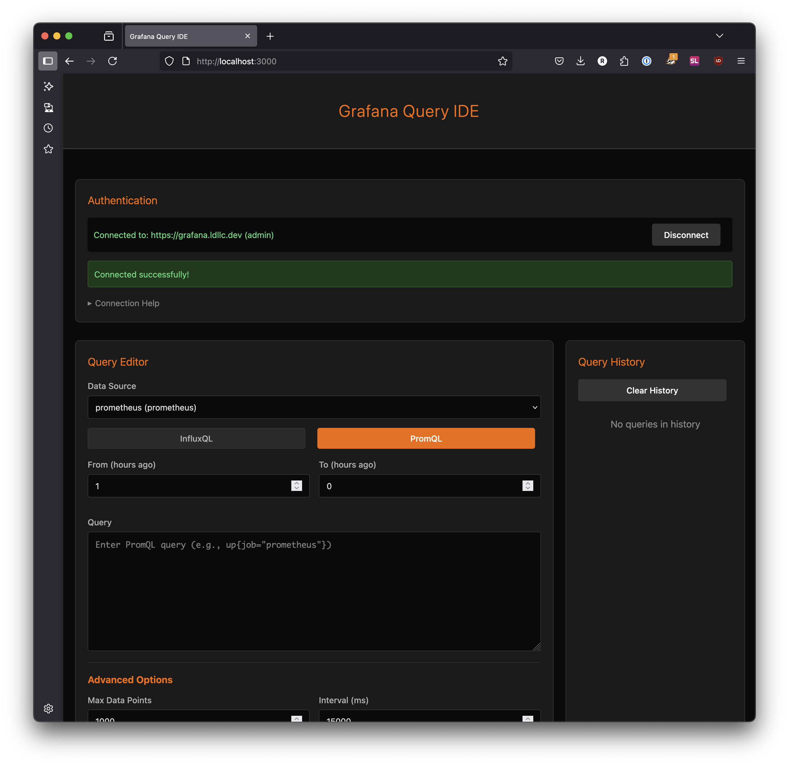
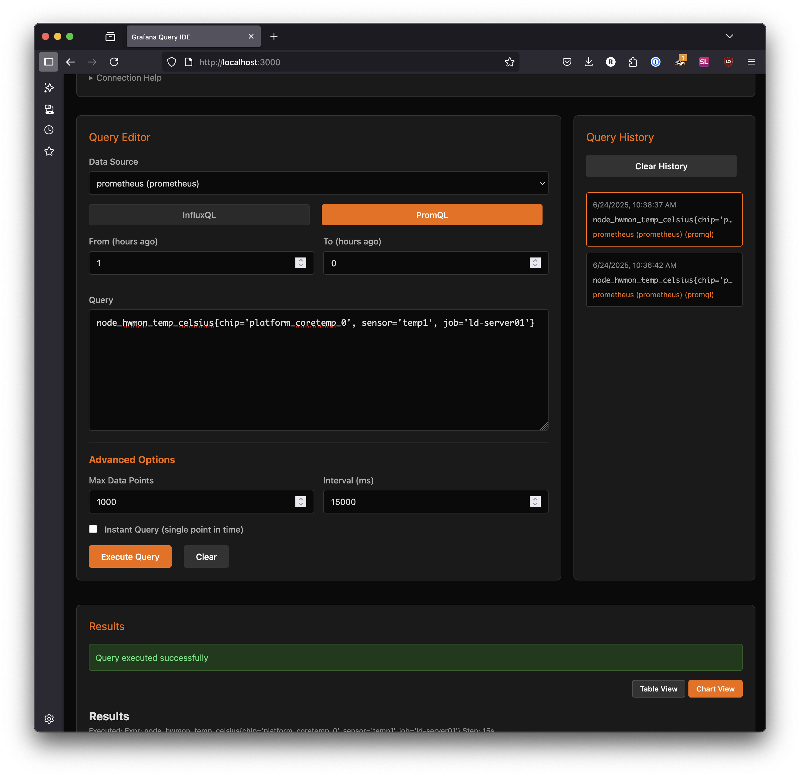
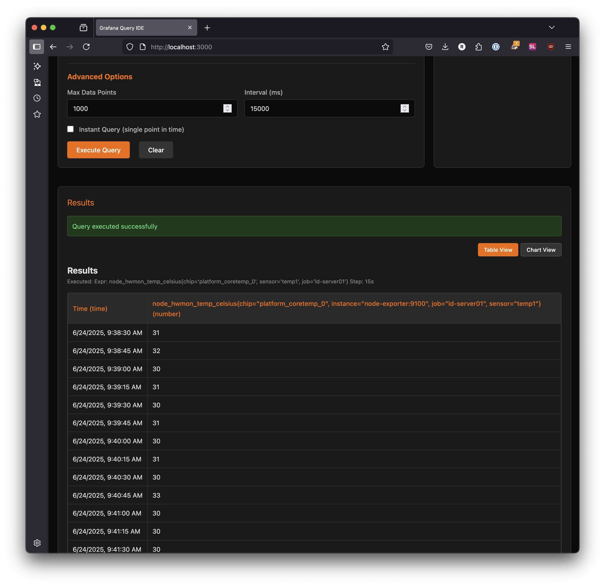

# Grafana Query IDE

A web-based IDE for executing InfluxQL and PromQL queries through the Grafana API. Features a built-in proxy to handle CORS issues and a clean, dark-themed interface.

## Features

- 🔐 Basic authentication support for Grafana
- 📊 Support for both InfluxQL and PromQL queries
- 🔍 Auto-discovery of InfluxDB and Prometheus data sources
- 📝 Query history saved in browser local storage
- 🎯 Clean table-based and chart-view result display
- 🚀 Built-in CORS proxy
- 🐳 Docker support for easy deployment
- 🔒 Handles self-signed SSL certificates

## Screenshots

<div style="display: flex; overflow-x: auto; gap: 10px; padding: 10px 0;">
  
  
  
  
</div>

## Quick Start with Docker

The easiest way to run Grafana Query IDE is with Docker:

```bash
# Clone the repository
git clone https://github.com/yourusername/grafana-query-ide.git
cd grafana-query-ide

# Start with Docker Compose
docker-compose up -d

# Or build and run manually
docker build -t grafana-query-ide .
docker run -d -p 3000:3000 --name grafana-query-ide grafana-query-ide
```

Open http://localhost:3000 in your browser.

## Usage

1. **Connect to Grafana**
   - Enter your Grafana URL (e.g., `https://grafana.example.com`)
   - Enter your username and password
   - Click "Connect"

2. **Select a Data Source**
   - Choose from available InfluxDB or Prometheus data sources

3. **Write and Execute Queries**
   - Select query type (InfluxQL or PromQL)
   - Write your query
   - Click "Execute Query"

4. **View Results**
   - Results are displayed in a clean table format or a basic chart view
   - Raw JSON response available for debugging

5. **Query History**
   - All executed queries are saved automatically
   - Click any history item to reload it
   - Clear history when needed

## Example Queries

### InfluxQL
```sql
SELECT mean("value") FROM "temperature" WHERE time > now() - 1h GROUP BY time(5m)
SELECT * FROM "cpu" WHERE host = 'server1' AND time > now() - 24h
```

### PromQL
```promql
up{job="prometheus"}
rate(http_requests_total[5m])
avg_over_time(temperature{location="office"}[1h])
```

## Architecture

```
┌─────────────────┐     ┌─────────────────┐     ┌─────────────────┐
│   Web Browser   │────▶│  Express Server │────▶│ Grafana Instance│
│  (Query IDE UI) │     │ (CORS Proxy)    │     │   (Your API)    │
└─────────────────┘     └─────────────────┘     └─────────────────┘
         Port 3000              │
                               │
                        Handles CORS,
                        SSL certificates,
                        Authentication
```

## Environment Variables

- `PORT` - Server port (default: 3000)
- `NODE_ENV` - Node environment (default: production)

## Security Notes

- Passwords are never saved to local storage
- Basic auth credentials are transmitted over HTTPS when possible
- The proxy accepts self-signed certificates (use with caution in production)
- All API requests are proxied through the server to handle CORS

## File Structure

```
grafana-query-ide/
├── Dockerfile
├── docker-compose.yml
├── package.json
├── server.js              # Express server with proxy
├── public/
│   └── index.html        # Query IDE interface
└── README.md
```

## Troubleshooting

### Connection Issues
- **401 Unauthorized**: Check your username and password
- **404 Not Found**: Verify your Grafana URL is correct
- **CORS Errors**: Make sure you're using the Docker container or running the proxy server

### Query Issues
- Ensure your data source is properly configured in Grafana
- Check that the user has permissions to query the data source
- Verify query syntax for your specific database

## Development

To modify the application:

1. Edit `public/index.html` for UI changes
2. Edit `server.js` for proxy/server changes
3. Rebuild the Docker image after changes:
   ```bash
   docker-compose build
   docker-compose up -d
   ```

## Contributing

Contributions are welcome! Please feel free to submit a Pull Request.

## License

MIT License - feel free to use this in your own projects!